1. Done 
2. my_app/logs, install redis 
3. 8 STATES := app tests - is a variable with dynamically assigned values. 
 REPO := docker repo name 
..PHONY - is used to create a virtual target of makefile because STATE isn't a physical file. 
 $(STATES): - use of app or tests variables. 
 docker build - creates new docker container. 
 $(@) - variables from STATE(app, tests). 
 run - execute commands. 
 docker-prune - remove all the previous dockers. 
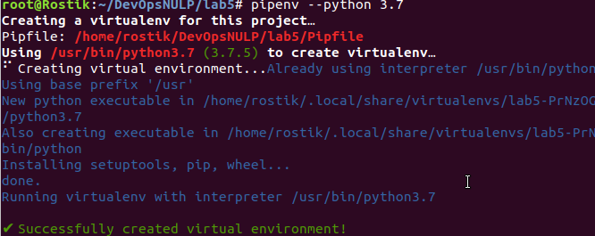 
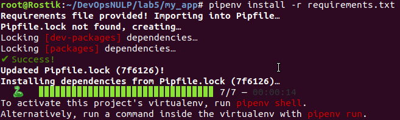 
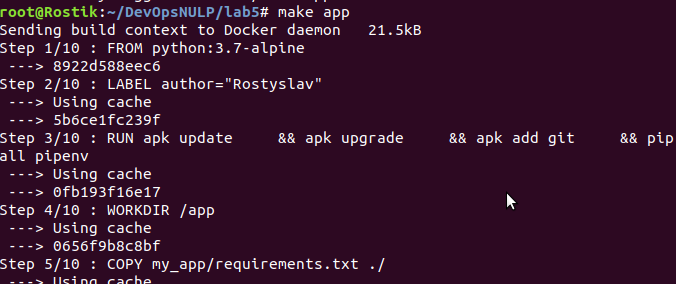 
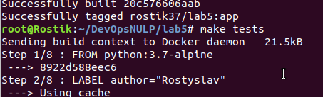 
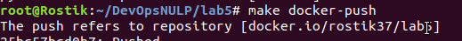 
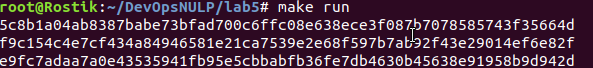 
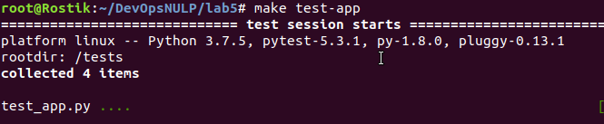 
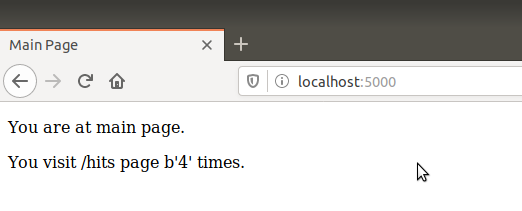 
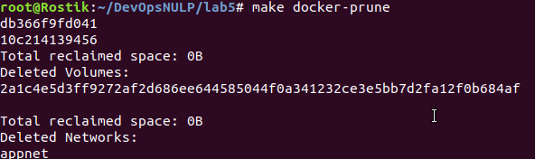 
4. Done 
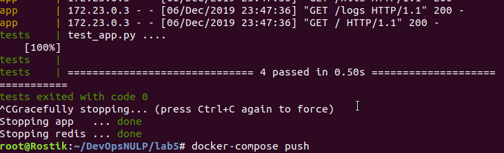 
5. Makefile is better in this situation because of small amount of operations. 
Link to dockerhub: https://hub.docker.com/repository/docker/rostik37/lab5  
6. Done, yml file in lab4 
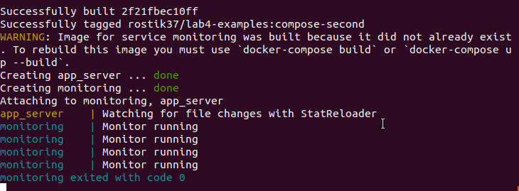
